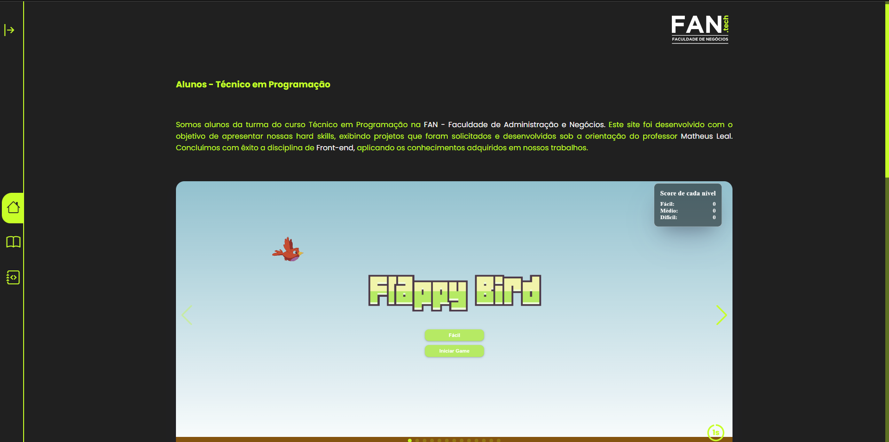
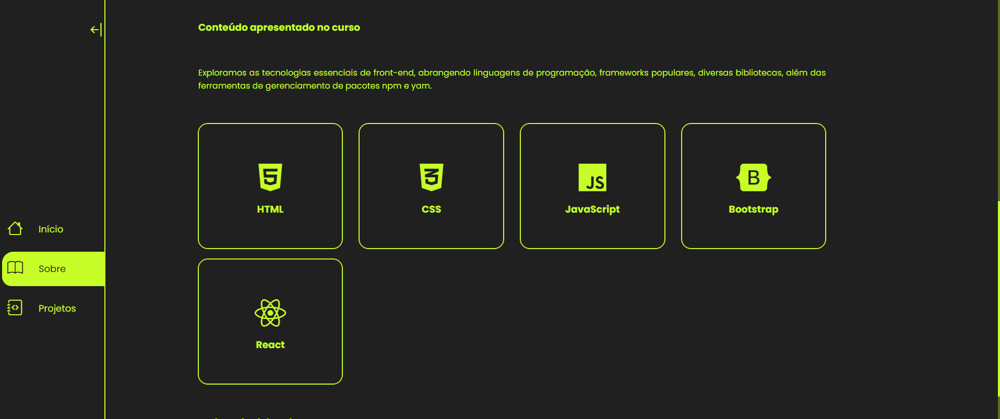
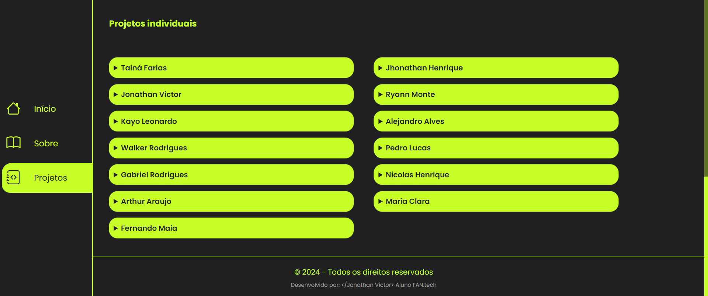

  

# Alunos - Técnico em Programação | Portfólio Geral
### Direcionamento deploy: [Portfólio Geral](https://portfolio-geral-fantech.vercel.app/)
### Seja direcionado para FAN.tech: [FAN.tech](https://fan-edu.com.br/fantech/)

## Sobre 
#### O portfólio da turma é destinado à divulgação dos projetos desenvolvidos na disciplina de Front-end. Aqui, você encontrará os projetos individuais dos alunos da turma de Técnico em Programação no período matutino

  

  

  

